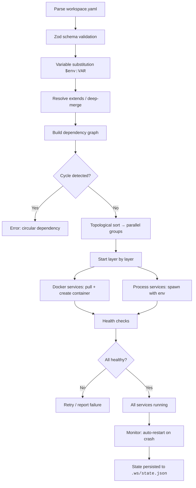

<h1 align="center">ws</h1>

<p align="center">
  <strong>One YAML. One command. Entire dev environment up.</strong>
</p>

<p align="center">
  A declarative workspace manager that clones repos, starts Docker containers,<br>
  launches processes — all in dependency order — from a single config file.
</p>

<p align="center">
  =20">
  
  
  
</p>

---

## Why `ws`?

You onboard a new team member. They clone the mono-repo, install deps, start 5 services in 3 terminals, boot a Redis container, set env vars... 30 minutes later they're still reading the wiki.

**Or**: they run `ws start`. Done.

```bash
ws init      # scaffold workspace.yaml
ws setup     # clone repos, install dependencies
ws start     # launch everything in dependency order
ws stop      # graceful shutdown in reverse order
```

## Comparison

| | **ws** | **Docker Compose** | **Dev Containers** | **Nix** |
|---|---|---|---|---|
| **Service types** | Git repos + local processes + Docker containers | Docker containers only | Full container environment | Nix derivations |
| **Config format** | Single YAML, zero learning curve | YAML (compose spec) | JSON (devcontainer.json) | Nix language (steep curve) |
| **Setup required** | `npm install -g` | Docker Desktop | VS Code + Docker | Nix installer + flakes |
| **Dependency management** | Topological sort, parallel start | `depends_on` with conditions | N/A | Nix builds |
| **Git integration** | Built-in clone/branch/checkout | Manual | Manual | Manual |
| **Mixed environments** | Native processes + Docker side-by-side | Docker only | Everything in container | Nix shell |
| **Crash recovery** | Auto-restart with exponential backoff | `restart: unless-stopped` | N/A | Process manager needed |
| **Weight** | Lightweight CLI (~180KB) | Docker daemon required | Full Docker + VS Code | Nix store (large) |

**When to use ws**: You need a lightweight tool that manages git repos, local processes, and Docker containers from a single YAML file — without containerizing everything or learning a new language.

## Features

- **Declarative config** — One `workspace.yaml` describes your entire dev environment
- **Dependency-aware scheduling** — Topological sort ensures services start in the right order; independent services start in parallel
- **Git + Docker + Processes** — Clone repos, manage containers, and run commands from a single file
- **Plugin system** — Lifecycle hooks (`onConfigLoaded`, `onServiceReady`, `onAllReady`, ...) let you extend behavior without forking
- **Crash recovery** — Auto-restart failed processes with configurable policy (exponential backoff, default max 3 retries), persistent state via `.ws/state.json`
- **Environment variable injection** — `$env:VAR_NAME` syntax in YAML, resolved at load time; `.env` file support via `env_file` field
- **Config inheritance** — `extends: ./base.yaml` with deep-merge semantics
- **Log aggregation** — `ws logs` aggregates all service logs with color-coded prefixes; `ws logs --tail` streams in real time
- **Shell into services** — `ws shell <service>` opens a shell with the service's env vars (masked secrets); `ws shell --cmd` runs a one-off command
- **Doctor mode** — `ws doctor` detects zombie processes, orphaned containers, stale state, and port conflicts; `ws doctor --fix` auto-cleans
- **Cross-platform** — Windows, macOS, Linux. Git via isomorphic-git (no git binary needed), processes via native shell

## Quick Start

### Install

```bash
# Install globally from npm (recommended)
npm install -g @alfroul/cli
ws --version
```

> **Note**: Using npm install doesn't require a Node.js development environment — just Node.js runtime >= 20.

<details>
<summary>Build from source</summary>

```bash
git clone https://github.com/Alfroul/ws.git
cd ws
pnpm install
pnpm build

# Link globally for development
cd packages/cli && pnpm link --global
ws --version
```

</details>

> **Prerequisites**: Node.js >= 20, pnpm (for source build), Docker (optional, for container services)

### Usage

```bash
# 1. Initialize a workspace
ws init

# 2. Edit workspace.yaml — add your services
# 3. Clone repos and run setup commands
ws setup

# 4. Start all services
ws start

# 5. Check status
ws status

# 6. Stop everything
ws stop
```

## workspace.yaml Reference

### Full Example

```yaml
version: 1
name: my-project

# Inherit from a base config (optional)
extends: ./base.yaml

# Load plugins (optional)
plugins:
  - "./plugins/my-plugin.js"

services:
  # Process service — a local command
  api:
    type: process
    repo: https://github.com/myorg/api.git
    branch: develop          # optional, defaults to main
    workdir: ./api           # optional, defaults to service name
    setup: npm install       # optional, runs during ws setup
    start: npm start
    env:
      PORT: "3000"
      DATABASE_URL: "$env:DATABASE_URL"   # resolved from process.env
    depends_on:
      - redis

  # Docker service — a container
  redis:
    type: docker
    image: redis:7-alpine
    ports:
      - "6379:6379"
    env:
      REDIS_PASSWORD: "$env:REDIS_PASSWORD"
    depends_on: []
    health_check:
      type: http
      url: http://localhost:6379
      interval: 5000
      timeout: 30000

  # Minimal process service
  worker:
    type: process
    start: node worker.js
    depends_on:
      - redis
      - api

# Lifecycle hooks (optional)
hooks:
  post_setup:
    - echo "Setup done!"
  pre_start:
    - echo "Starting..."
  post_start:
    - echo "All services started"
  pre_stop:
    - echo "Stopping..."
  post_stop:
    - echo "All services stopped"
```

### Field Reference

**Top-level**

| Field | Type | Required | Description |
|-------|------|----------|-------------|
| `version` | `1` | Yes | Config schema version (currently only `1`) |
| `name` | `string` | Yes | Workspace name |
| `extends` | `string` | No | Base config path; `services` are deep-merged |
| `plugins` | `string[]` | No | Plugin paths (local files or `@alfroul/plugin-*` packages) |
| `services` | `Record<string, Service>` | Yes | Service definitions |
| `hooks` | `object` | No | Lifecycle hook commands |

**Process Service**

| Field | Type | Required | Description |
|-------|------|----------|-------------|
| `type` | `"process"` | Yes | Service type discriminator |
| `repo` | `string` | No | Git repo URL (cloned during `ws setup`) |
| `branch` | `string` | No | Git branch (default: `main`) |
| `workdir` | `string` | No | Working directory (default: service name) |
| `setup` | `string` | No | Command to run during `ws setup` |
| `start` | `string` | Yes | Command to start the service |
| `env` | `Record<string, string>` | No | Environment variables |
| `env_file` | `string` | No | Path to `.env` file (values merged, YAML `env` takes precedence) |
| `depends_on` | `string[]` | No | Services that must start before this one |

**Docker Service**

| Field | Type | Required | Description |
|-------|------|----------|-------------|
| `type` | `"docker"` | Yes | Service type discriminator |
| `image` | `string` | Yes | Docker image |
| `ports` | `string[]` | No | Port mappings (e.g. `"8080:80"`) |
| `env` | `Record<string, string>` | No | Container environment variables |
| `env_file` | `string` | No | Path to `.env` file (values merged, YAML `env` takes precedence) |
| `depends_on` | `string[]` | No | Services that must start before this one |
| `health_check` | `object` | No | Health check config (see below) |

**Health Check**

| Field | Type | Required | Description |
|-------|------|----------|-------------|
| `type` | `"http"` \| `"tcp"` | Yes | Check type |
| `url` | `string` | For `http` | URL to check (e.g. `http://localhost:3000/health`) |
| `port` | `number` | For `tcp` | Port to check |
| `interval` | `number` | No | Check interval in ms (default: `5000`) |
| `timeout` | `number` | No | Max wait time in ms (default: `30000`) |

### Variable Substitution

Use `$env:VAR_NAME` in any string value to inject environment variables:

```yaml
env:
  DATABASE_URL: "$env:DATABASE_URL"
  API_KEY: "$env:MY_API_KEY"
```

Missing variables default to an empty string.

## CLI Reference

| Command | Description |
|---------|-------------|
| `ws init` | Interactively create a `workspace.yaml` |
| `ws setup` | Clone repos and run setup commands |
| `ws start` | Start all services in dependency order |
| `ws stop` | Stop all services in reverse dependency order |
| `ws status` | Show service status table |
| `ws status --watch` | Live-refresh status every 2s |
| `ws add` | Interactively add a service |
| `ws remove <service>` | Remove a service (stops it first if running) |
| `ws logs [service]` | Show service logs (omit service to show all, color-coded) |
| `ws logs --tail` | Follow log output in real time (alias: `-f`) |
| `ws shell <service>` | Open a shell in the service's working directory (env vars loaded, secrets masked) |
| `ws shell <service> --cmd <cmd>` | Run a single command in the service's environment (non-interactive) |
| `ws doctor` | Diagnose zombie processes, orphaned containers, stale state, port conflicts |
| `ws doctor --fix` | Auto-fix detected issues (clean stale state, stop orphans) |
| `ws completion` | Output shell completion script |

**Global options**: `-c, --config <path>` (config file) · `--verbose` (detailed logs) · `--json` (machine-readable output) · `--version` · `--help`

## Plugin Development

> **⚠️ Experimental**: The plugin system is in early stages. The API may change between minor versions. Feedback welcome via [GitHub Issues](https://github.com/Alfroul/ws/issues).

Plugins implement the `WsPlugin` interface and hook into workspace lifecycle events.

### Interface

```typescript
interface WsPlugin {
  name: string;

  onConfigLoaded?: (config: WorkspaceConfig) => Promise<void> | void;
  onBeforeSetup?: (config: WorkspaceConfig) => Promise<void> | void;
  onServiceReady?: (serviceName: string) => Promise<void> | void;
  onAllReady?: () => Promise<void> | void;
  onBeforeStop?: () => Promise<void> | void;

  commands?: Array<{
    name: string;
    description: string;
    action: (...args: unknown[]) => Promise<void> | void;
  }>;
}
```

### Example Plugin

```typescript
// plugins/slack-notify.ts
import type { WsPlugin } from "@alfroul/plugin-api";

const slackNotify: WsPlugin = {
  name: "slack-notify",

  onAllReady() {
    fetch("https://hooks.slack.com/...", {
      method: "POST",
      body: JSON.stringify({ text: "All services are up!" }),
    });
  },

  onServiceReady(serviceName) {
    console.log(`Service ${serviceName} is ready`);
  },

  commands: [
    {
      name: "ping",
      description: "Test plugin command",
      action() {
        console.log("pong");
      },
    },
  ],
};

export default slackNotify;
```

### Loading Plugins

**From a local file** — add to `workspace.yaml`:

```yaml
plugins:
  - "./plugins/slack-notify.js"
```

**From npm** — publish as `@alfroul/plugin-slack-notify`, install in your project, and `ws` will auto-discover it.

### Built-in Plugins

| Plugin | Description |
|--------|-------------|
| `@alfroul/plugin-notifications` | Desktop notifications on service lifecycle events |
| `@alfroul/plugin-health-check` | Periodic HTTP health checks for process services |

## Architecture

### Package Layout

```
CLI (Commander.js)
  └── Core Engine
        ├── Config Parser    YAML → Zod validation → variable substitution → extends merge
        ├── Scheduler        Topological sort → parallel groups
        ├── Git Manager      isomorphic-git (pure JS, cross-platform)
        ├── Docker Manager   dockerode (container lifecycle + health checks)
        ├── Process Manager  child_process + auto-restart (exponential backoff)
        ├── Plugin System    Lifecycle hooks + custom CLI commands
        └── State Store      .ws/state.json (atomic writes, crash recovery)
```

### `ws start` Execution Flow



**Design principles**:

- **Declarative** — describe what, not how
- **Dependency-aware** — topological sort with parallel grouping for speed
- **Extensible** — plugins at every lifecycle stage
- **Resilient** — state persistence + `ws doctor` for crash recovery

## Development

```bash
pnpm install          # install dependencies
pnpm build            # build all packages
pnpm test             # run all tests
pnpm typecheck        # type-check all packages
```

### Project Structure

```
ws/
├── packages/
│   ├── cli/              CLI entry point and commands
│   ├── core/             Engine, scheduler, lifecycle, state
│   ├── config/           YAML parser, Zod schemas, validator
│   ├── git/              Git clone/pull/status (isomorphic-git)
│   ├── docker/           Container lifecycle + health checks (dockerode)
│   ├── process/          Process manager + crash restart
│   ├── plugin-api/       Plugin loader + hook executor
│   └── utils/            Logger, spinner, fs utilities
├── plugins/
│   ├── notifications/    Desktop notification plugin
│   └── health-check/     HTTP health-check plugin
├── examples/
│   └── mini-project/     End-to-end demo project
└── tests/                Shared fixtures and helpers
```

## FAQ

**`ws start` fails for Docker services?**
Make sure Docker Desktop (or Docker Engine) is running. `ws` uses the Docker API — check with `docker info`.

**`$env` substitution not working?**
Verify the variable is exported in your shell: `echo $VAR_NAME`. You can also use a `.env` file (gitignored by default).

**Process doesn't auto-restart?**
Default policy is 3 retries with exponential backoff (1s, 2s, 4s). Check `.ws/logs/` for crash logs. After max retries, `ws status` shows `crashed`. You can configure the restart policy per project via the plugin system.

**How to add a custom plugin?**
Add `plugins: ["./path/to/plugin.js"]` to `workspace.yaml`. The plugin must export an object matching the `WsPlugin` interface. See [Plugin Development](#plugin-development).

**Supported platforms?**
macOS, Linux, and Windows. Git operations use isomorphic-git (pure JS, no git binary required).

## License

[MIT](./LICENSE)
